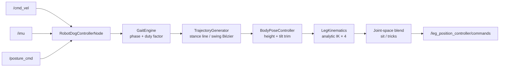

<div align="center">

# 🐕 robot_dog_gait

Natural **gait generation** and analytic **inverse kinematics** for a 12-DOF quadruped in ROS 2.  
Teleop-driven trot / walk / pace / bound with cubic Bézier swing trajectories, optional IMU body leveling, and joint-space posture tricks.


</div>

---

## 📋 Table of Contents

- [Overview](#-overview)
- [Package Structure](#-package-structure)
- [Dependencies](#-dependencies)
- [Installation & Build](#-installation--build)
- [Running](#-running)
- [How It Works](#-how-it-works)
- [Scientific Methods](#-scientific-methods)
- [Parameters](#-parameters)
- [Topics](#-topics)
- [Keyboard Teleop](#-keyboard-teleop)
- [Testing](#-testing)

---

## 🎯 Overview

This package turns `/cmd_vel` into smooth 12-joint position commands for a Spot-like quadruped. A deterministic gait clock assigns each leg a swing / stance phase; foot targets are shaped with cubic Bézier arcs (swing) and linear retraction (stance), then solved with closed-form 3-DOF inverse kinematics and published to `ros2_control`.

| Node | Executable | Role |
|---|---|---|
| `RobotDogControllerNode` | `robot_dog_controller_node` | Gait clock → foot trajectories → IK → joint commands; sit / stand / tricks |
| `KeyboardTeleopNode` | `robot_dog_teleop_node` | WASD teleop + posture keys (`sit`, `wave`, …) |

The simulation stack is **self-contained**: URDF, meshes, Gazebo world, and controller YAML live in this package (no sibling description package required at runtime).

---

# 🎥 Demo

The following video demonstrates the **Robot Dog Gait** system running with ROS 2 and Gazebo:

<div align="center">

[](https://youtu.be/o2na5xc01gE)

**▶️ Watch the Robot Dog Gait Demo**

</div>

---

## 📁 Package Structure

```
robot_dog_gait/
├── include/robot_dog_gait/
│   ├── bezier_curve.hpp              # Cubic Bézier evaluator
│   ├── body_pose_controller.hpp      # Height trim + linearized IMU leveling
│   ├── gait_engine.hpp               # Phase-offset gait clock (trot/walk/pace/bound)
│   ├── keyboard_teleop_node.hpp
│   ├── leg_kinematics.hpp            # Analytic IK / FK
│   ├── robot_dog_controller_node.hpp # ROS 2 orchestrator
│   ├── robot_dog_model.hpp           # Geometry + leg mounts
│   ├── trajectory_generator.hpp      # Stance line + swing Bézier
│   └── trick_player.hpp              # Keyframed joint-space tricks
├── src/
│   ├── *_main.cpp                    # Node entry points
│   └── *.cpp                         # Core + node implementations
├── config/
│   ├── gait_params.yaml              # Controller tunables
│   └── spot_controllers.yaml         # ros2_control (position + broadcaster)
├── launch/
│   ├── gazebo.launch.py              # Full sim stack
│   ├── gait_controller.launch.py     # Controller only
│   └── display.launch.py             # RViz + joint sliders (no Gazebo)
├── urdf/  meshes/  worlds/  rviz/  test/
├── CMakeLists.txt
├── package.xml
└── README.md
```

---

## 📦 Dependencies

| Package | Description |
|---|---|
| [`rclcpp`](https://github.com/ros2/rclcpp) | ROS 2 C++ client library |
| [`geometry_msgs`](https://github.com/ros2/common_interfaces) | `Twist` teleop commands |
| [`std_msgs`](https://github.com/ros2/common_interfaces) | Joint `Float64MultiArray`, posture `String` |
| [`sensor_msgs`](https://github.com/ros2/common_interfaces) | IMU orientation (optional leveling) |
| [`rcl_interfaces`](https://github.com/ros2/rcl_interfaces) | Runtime parameter updates |
| `robot_state_publisher` / `rviz2` | Visualization |
| `ros_gz_sim` / `ros_gz_bridge` | Gazebo Sim + sensor bridges |
| `controller_manager` / `joint_state_broadcaster` / `position_controllers` / `gz_ros2_control` | Actuation in sim |

---

## 🔧 Installation & Build

### Prerequisites

- ROS 2 Jazzy (or compatible) with Gazebo Sim / `ros_gz` and `ros2_control` packages installed
- A colcon workspace (e.g. `~/ros2_ws`)

### Build

```bash
cd ~/ros2_ws
# clone or copy this package into src/
colcon build --packages-select robot_dog_gait
source install/setup.bash
```

---

## 🚀 Running

### Option 1 — Full Gazebo Stack (Recommended)

Starts Gazebo, spawns the robot, loads `ros2_control`, bridges sensors (IMU, lidar, camera, foot contacts), launches RViz, and starts the gait controller.

```bash
ros2 launch robot_dog_gait gazebo.launch.py

# Custom world / spawn pose
ros2 launch robot_dog_gait gazebo.launch.py world_sdf:=/path/to/world.sdf x:=1.0 y:=0.5

# Restart/tune the gait node without killing Gazebo
ros2 launch robot_dog_gait gazebo.launch.py spawn_gait_controller:=false
# then, in another terminal:
ros2 launch robot_dog_gait gait_controller.launch.py
```

In a second terminal, drive with the built-in teleop:

```bash
ros2 run robot_dog_gait robot_dog_teleop_node
```

### Option 2 — Controller Only

> Requires `/leg_position_controller/commands` (or your remapped topic) and a live robot / sim.

```bash
ros2 launch robot_dog_gait gait_controller.launch.py
# or with a custom params file:
ros2 launch robot_dog_gait gait_controller.launch.py params_file:=/path/to/gait_params.yaml
```

### Option 3 — Model Preview (No Simulation)

URDF in RViz with joint sliders — useful for mesh / geometry checks:

```bash
ros2 launch robot_dog_gait display.launch.py
```

---

## 🔄 How It Works



**Flow summary:**

1. Teleop publishes body velocity (`linear.x/y`, `angular.z`) and optional posture strings.
2. Step frequency scales with commanded speed; while standing still the gait clock freezes (no foot pops on resume).
3. Per-leg velocity includes turning: `v_leg = v_body + ω × r` at each hip mount so outer legs take longer strides.
4. `GaitEngine` maps a global phase + fixed offsets into swing / stance progress (`duty_factor`).
5. `TrajectoryGenerator` builds a foot offset: linear stance push, cubic Bézier swing with peak clearance `step_height`.
6. Optional IMU roll/pitch applies a small Z trim per leg (linearized body leveling).
7. Analytic IK converts each 3D foot target into `hip_roll`, `hip_pitch`, `knee`.
8. Sit / tricks blend in **joint space** (not IK) so deep poses stay reachable; gait is locked out while posture-locked.

---

## 🔬 Scientific Methods

| Method | Where | Role |
|---|---|---|
| Analytic inverse kinematics | `leg_kinematics` | Closed-form 3-DOF IK (YZ abduction + planar 2-link via law of cosines) |
| Forward kinematics | `leg_kinematics` | Neutral standing foot targets + tests |
| Cubic Bézier (Bernstein) | `bezier_curve`, `trajectory_generator` | Smooth swing arc; control Z scaled by `4/3` so apex = `step_height` |
| Linear stance trajectory | `trajectory_generator` | Foot slides `+stride/2 → −stride/2` to propel the body |
| Phase-offset gait scheduling | `gait_engine` | Deterministic offsets (not CPG): trot / walk / pace / bound + duty factor |
| Rigid-body velocity composition | controller | `v = v_body + ω × r` for natural turning strides |
| Linearized body leveling | `body_pose_controller` | Foot Z trim ∝ lever arm × measured roll/pitch |
| Quaternion → Euler | controller | Roll/pitch from IMU (REP-103); yaw unused |
| Joint-space lerp / keyframes | `trick_player`, sit blend | Soft sit/stand and wave / play_bow / beg / shake |

---

## ⚙️ Parameters

Defaults live in [`config/gait_params.yaml`](config/gait_params.yaml). Many can be changed at runtime (`ros2 param set`).

| Parameter | Default | Description |
|---|---|---|
| `cmd_vel_topic` | `/cmd_vel` | Teleop twist input |
| `imu_topic` | `/imu` | Optional orientation for leveling |
| `joint_commands_topic` | `/leg_position_controller/commands` | 12-DOF position command array |
| `posture_cmd_topic` | `/posture_cmd` | `sit` / `stand` / trick strings |
| `control_frequency_hz` | `100.0` | Control loop rate |
| `cmd_vel_timeout_sec` | `0.0` | `≤0` latch last cmd; `>0` hold-to-drive timeout |
| `max_linear_speed` | `0.4` | m/s clamp |
| `max_angular_speed` | `1.0` | rad/s clamp |
| `max_stride` | `0.18` | m, safety clamp on computed stride |
| `gait_type` | `trot` | `trot` \| `walk` \| `pace` \| `bound` |
| `duty_factor` | `0.5` | Stance fraction of the cycle |
| `min_step_frequency_hz` | `0.8` | Step rate at low speed |
| `max_step_frequency_hz` | `2.2` | Step rate at max speed |
| `step_height` | `0.06` | m, peak swing clearance |
| `control_point_fraction` | `0.2` | Bézier control placement (smaller = punchier) |
| `use_imu_feedback` | `false` | Enable tilt compensation |
| `body_height_trim` | `0.0` | m, raise (+) / crouch (−) |
| `sit_*` / `sit_transition_duration_sec` | see YAML | Joint-space sit pose and blend time |

**Example:**

```bash
ros2 param set /robot_dog_controller_node gait_type walk
ros2 param set /robot_dog_controller_node step_height 0.08
```

---

## 📡 Topics

### Subscribed

| Topic | Type | Description |
|---|---|---|
| `/cmd_vel` | `geometry_msgs/Twist` | Body velocity command |
| `/imu` | `sensor_msgs/Imu` | Orientation for optional leveling |
| `/posture_cmd` | `std_msgs/String` | `sit`, `stand`, `wave`, `play_bow`, `beg`, `shake` |

### Published

| Topic | Type | Description |
|---|---|---|
| `/leg_position_controller/commands` | `std_msgs/Float64MultiArray` | 12 joint positions (FL, FR, RL, RR × roll/pitch/knee) |

Gazebo launch also bridges `/scan`, `/camera`, `/foot_contact/{fl,fr,rl,rr}`, and `/clock` for simulation.

---

## ⌨️ Keyboard Teleop

```bash
ros2 run robot_dog_gait robot_dog_teleop_node
```

| Key | Action |
|---|---|
| `w` / `s` | Forward / backward |
| `a` / `d` | Strafe left / right |
| `q` / `e` | Turn left / right |
| `x` / `Space` | Stop |
| `z` / `c` | Sit / stand |
| `r` / `f` / `g` / `t` | Wave / play bow / beg / shake |
| `v` / `b` | Increase / decrease speed |
| `Ctrl-C` | Quit |

---

## 🧪 Testing

```bash
cd ~/ros2_ws
colcon test --packages-select robot_dog_gait
colcon test-result --verbose
```

Standalone gtests cover analytic IK/FK consistency and gait / trajectory phase behavior (`test/`).

---

<div align="center">
<sub>ROS 2 · Quadruped Gait · Analytic IK · Cubic Bézier</sub>
</div>
